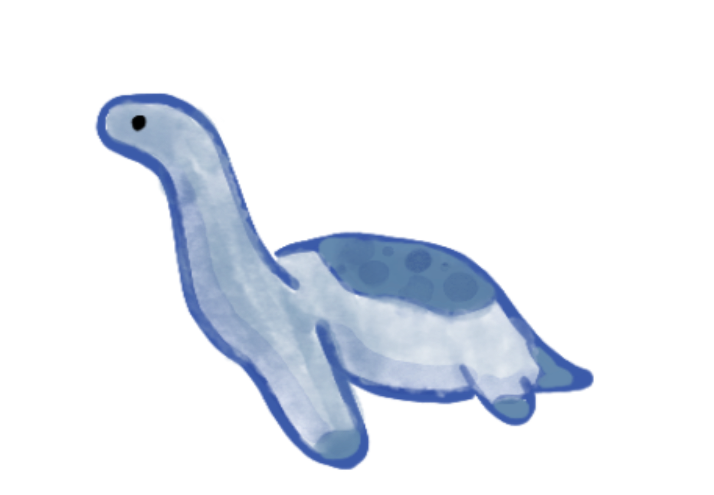
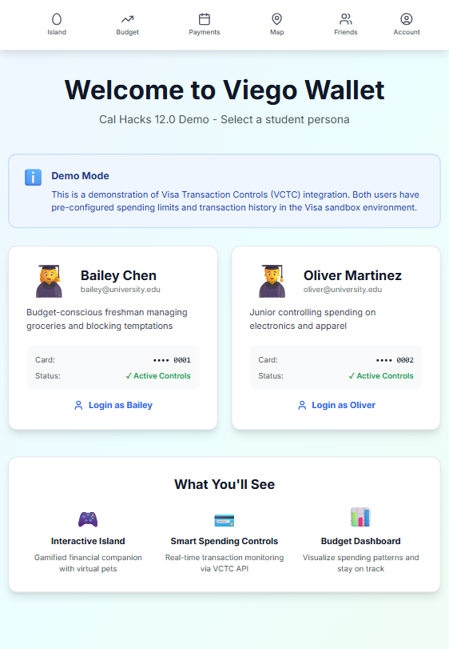
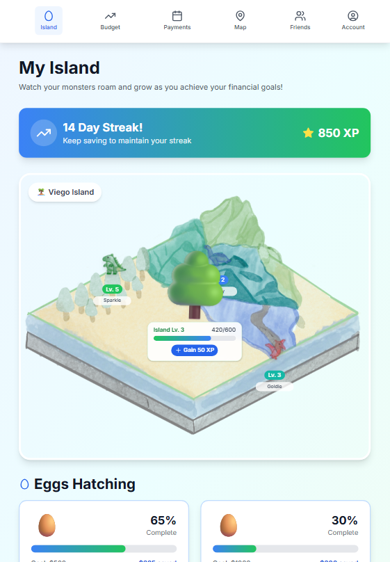
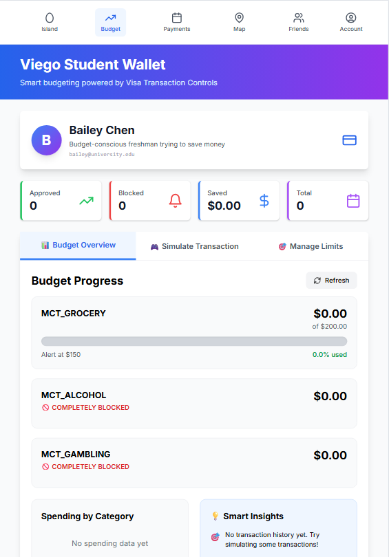
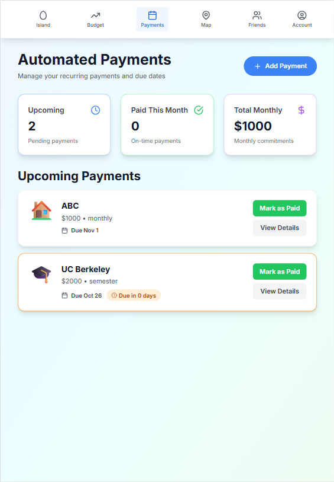
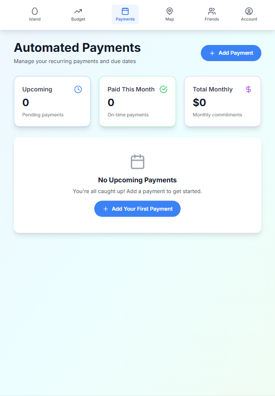
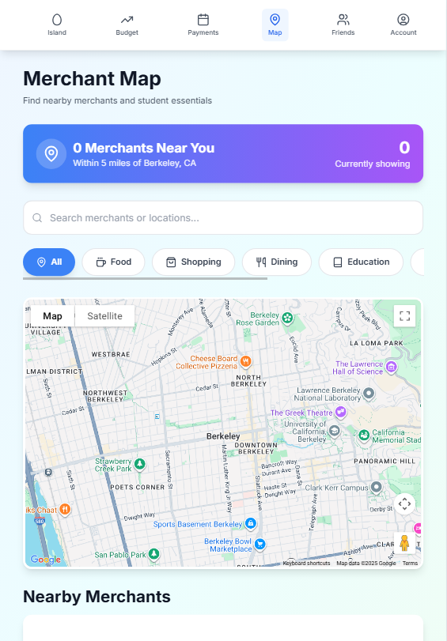
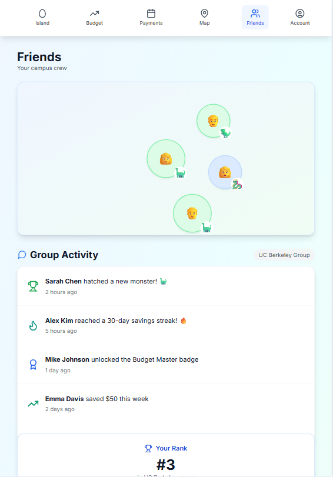
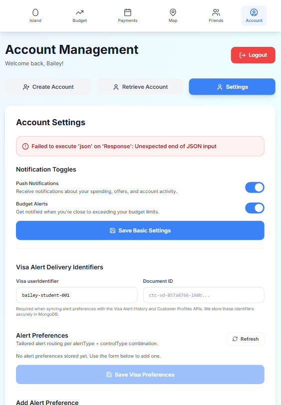

  

# Save Dinos: A Visa Wallet (CalHacks 2025 Submission)

Save Dinos is a gamified Visa wallet for students that makes saving and financial education fun. Hit goals like skipping takeout or staying on budget to hatch and grow dinos on your island.

#### [Devpost](https://devpost.com/software/save-dinos-a-visa-wallet/)

#### [Try it out!](https://calhacks-viego.vercel.app/)

---

## App Overview

<table>
  <tr>
    <!-- <td align="center">
      
       
      <b>Login & Authentication</b>
    </td> -->
    <td align="center">
      
       
      <b>Dinosaur Island</b>
    </td>
    <td align="center">
      
       
      <b>Budget Management</b>
    </td>
    <td align="center">
      
       
      <b>Payments Overview</b>
    </td>
  </tr>
  <tr>
    <!-- <td align="center">
      
       
      <b>Payment Details</b>
    </td> -->
    <td align="center">
      
       
      <b>Map Navigation</b>
    </td>
    <td align="center">
      
       
      <b>Friends & Social</b>
    </td>
    <td align="center">
      
       
      <b>Account Settings</b>
    </td>
    <td></td>
  </tr>
</table>

---

## Inspiration
We were inspired by how apps like **Forest**, **Focus Friend**, and **Duolingo** make good habits feel rewarding. We wanted to bring that same energy to personal finance - turning budgeting and saving into something fun, social, and genuinely motivating for students. College is often the first time people manage their own money, so we set out to build a wallet that teaches financial literacy through play: collect and grow dinos as you save.

---

## What it does
**Save Dinos** is a **gamified Visa wallet** that helps students manage budgets, automate campus payments, and learn healthy financial habits.  
- When users meet goals (like skipping takeout or hitting their weekly savings target), their **dinosaurs hatch and evolve**, bringing their island to life.  
- The wallet uses **Visa’s APIs** to automate transactions, apply merchant offers, and enforce MCC-based (merchant category codes) spending controls (e.g., capping food-delivery spend).  
- A social layer lets students connect, share progress, and build friendly competition through streaks, badges, and campus challenges.

---

## How we built it
We began by **brainstorming all possible features**, mapping them into a detailed design doc, and then **scoping down** to a core set that aligned with the hackathon prompt: **budgeting**, **gamified savings**, and **Visa integration**.  
Starting with that shared design doc helped us clearly divide work and stay aligned on the product vision.  

**Stack & Tools:**  
- **Next.js** for rapid development and easy deployment.  
- **Tailwind CSS** for fast, consistent styling and component design.  
- **MongoDB (NoSQL)** to flexibly store user profiles, XP, badges, and monster data without schema constraints.  
- **Figma** for visual mockups and user flows.  
- **Claude Code** to accelerate turning design ideas into functional code through inline code generation.  

Our **system design** separated sensitive financial data (kept within Visa’s API layer) from user interaction data (stored in MongoDB) to stay secure and lightweight.

---

## Challenges we ran into
The toughest part was **configuring and understanding Visa’s two-way SSL authentication**. None of us had used client certificates or secure API authentication before, so setting up mutual SSL between our deployed client and Visa’s sandbox servers took time and experimentation. We also had to figure out which certificates were needed and how to integrate them correctly into our app.  

---

## Accomplishments that we're proud of
- Successfully configuring **Visa’s two-way SSL authentication** - a major technical milestone for our relatively new team.  
- Building a **clear, actionable design doc** that guided development and kept everyone aligned.  
- Delivering a functional prototype that ties **budgeting, gamification, and real Visa APIs** into one cohesive student wallet.  
- Most of all, we’re proud of the **idea itself** - making financial wellness approachable for students. It’s something we all wish we’d had.

---

## What we learned
- How Visa’s **Developer Platform (VDP)** works, including the logic of **transaction “decisions”** and **MCC-based card controls**.  
- The structure of **two-way SSL authentication**, what certificates do, and how servers determine who to trust.  
- How to leverage **inline coding agents** like Claude Code for collaborative, fast development.  
- The practical aspects of **financial automation APIs**, **merchant enrichment**, and **offer retrieval** within Visa’s ecosystem.  

---

## What's next for Save Dinos: A Visa Wallet
We see **Save Dinos** as more than a hackathon project - it’s a foundation for improving financial literacy among students.  
Inspired by **Focus Friend**, **Forest**, and **Pokémon GO**, we want to keep developing it into a mobile app that helps students form better money habits in a playful way. Future steps include:  
- Expanding the social ecosystem (campus vs. campus challenges, shared goals).  
- Enhancing creature evolution and island progression.  
- Integrating Visa’s **Practical Money Skills** API for real educational rewards.  
Ultimately, we hope to bring **Save Dinos** to the App Store as a fun, rewarding gateway to financial wellness.
