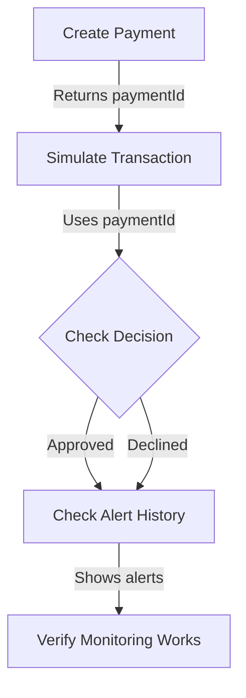

# Testing VCTC Integration - Complete Guide

## Overview

This guide shows you how to **actually test** that VCTC monitoring works by simulating transactions and checking alerts.

## Why This Matters

Before these endpoints, you could:
- ✅ Create a payment
- ✅ Create a VCTC monitoring rule
- ❌ **But no way to test if it actually works!**

Now you can:
- ✅ Simulate a transaction that matches your payment
- ✅ See if VCTC would trigger an alert
- ✅ Check alert history to verify monitoring is working
- ✅ **Actually test the full flow!**

---

## Prerequisites

1. VCTC credentials configured in `.env.local`
2. Certificates set up correctly
3. At least one payment created with a VCTC rule

---

## Step-by-Step Testing

### Step 1: Create a Test Payment

**Via UI:**
1. Visit `http://localhost:3000/payments/setup`
2. Fill out form:
   - Type: Rent
   - Merchant: "Test Property Management"
   - Amount: 800
   - Frequency: Monthly
   - Due Day: 1
3. Click "Create Payment"

**Via API:**
```bash
curl -X POST http://localhost:3000/api/payments \
  -H "Content-Type: application/json" \
  -d '{
    "userId": "demo_user",
    "type": "rent",
    "merchantName": "Test Property Management",
    "amount": 800,
    "frequency": "monthly",
    "dueDay": 1,
    "merchantCategoryCode": "6513",
    "reminderDays": [7, 3, 1]
  }'
```

**Response:**
```json
{
  "success": true,
  "payment": {
    "id": "pay_1234567890_abc",
    "vctcDocumentId": "ctc-vd-857a8766-160b-498d-820f-bf4339949c1b",
    ...
  }
}
```

**Save the `payment.id` - you'll need it for testing!**

---

### Step 2: Simulate a Transaction

This uses Visa's **Authorization Decision API** to simulate a transaction and see if your VCTC rule would trigger.

```bash
curl -X POST http://localhost:3000/api/test/simulate-transaction \
  -H "Content-Type: application/json" \
  -d '{
    "paymentId": "pay_1234567890_abc",
    "primaryAccountNumber": "4514170000000001"
  }'
```

**What This Does:**
1. Gets your payment details
2. Finds the associated VCTC rule
3. Simulates a transaction to "Test Property Management" for $800
4. VCTC checks if the rule triggers
5. Returns the decision

**Expected Response:**
```json
{
  "success": true,
  "payment": {
    "id": "pay_1234567890_abc",
    "merchantName": "Test Property Management",
    "amount": 800,
    "vctcDocumentId": "ctc-vd-857a..."
  },
  "simulatedTransaction": {
    "merchantName": "Test Property Management",
    "amount": 800,
    "card": "4514...0001"
  },
  "decision": {
    "shouldDecline": false,
    "declineReason": "N/A",
    "decisionId": "v-304-f1f11166...",
    "timestamp": "2025-10-25 12:34:56"
  },
  "interpretation": "✅ Transaction would be APPROVED (alert may still trigger)"
}
```

**What the Results Mean:**

| Result | Meaning |
|--------|---------|
| `shouldDecline: false` | ✅ Transaction approved - within your alert threshold |
| `shouldDecline: true` | ❌ Transaction declined - exceeded your decline threshold |
| `declineReason: "MERCHANT_CONTROL"` | 🎯 Your merchant rule triggered |
| `declineReason: "N/A"` | ℹ️ Transaction within limits, no action needed |

---

### Step 3: Test with Different Amounts

Try amounts that should trigger different behaviors:

**Test 1: Normal amount (should approve)**
```bash
curl -X POST http://localhost:3000/api/test/simulate-transaction \
  -H "Content-Type: application/json" \
  -d '{
    "paymentId": "pay_1234567890_abc",
    "amountOverride": 800
  }'
```
Expected: ✅ Approved

**Test 2: Over decline threshold (should decline)**
```bash
curl -X POST http://localhost:3000/api/test/simulate-transaction \
  -H "Content-Type: application/json" \
  -d '{
    "paymentId": "pay_1234567890_abc",
    "amountOverride": 900
  }'
```
Expected: ❌ Declined (900 > 880, which is 800 * 1.1)

**Test 3: Edge case**
```bash
curl -X POST http://localhost:3000/api/test/simulate-transaction \
  -H "Content-Type: application/json" \
  -d '{
    "paymentId": "pay_1234567890_abc",
    "amountOverride": 805
  }'
```
Expected: ✅ Approved but close to limit

---

### Step 4: Check Alert History

After simulating transactions, check if alerts were generated:

```bash
curl http://localhost:3000/api/test/alert-history?card=4514170000000001
```

**What This Does:**
1. Queries VCTC **Notification Inquiry API**
2. Gets all alerts/notifications for this card
3. Shows which transactions triggered rules

**Expected Response:**
```json
{
  "success": true,
  "card": "4514...0001",
  "totalAlerts": 2,
  "alerts": [
    {
      "id": "ctc-vd-45366159-40c2...",
      "timestamp": "2025-10-25 12:34:56",
      "merchant": {
        "name": "Test Property Management",
        "mcc": "6513",
        "city": "San Francisco",
        "state": "CA"
      },
      "transaction": {
        "amount": 800,
        "currency": "840",
        "id": "2101000000"
      },
      "outcome": {
        "approved": "APPROVED",
        "decisionId": "v-304-f1f11166..."
      },
      "alerts": [
        {
          "reason": "ALERT_THRESHOLD_EXCEEDED",
          "ruleType": "MERCHANT_CONTROL",
          "ruleCategory": "PCT_MERCHANT"
        }
      ]
    }
  ],
  "interpretation": "📬 Found 2 alert(s). These transactions triggered VCTC rules."
}
```

**Understanding Alert Reasons:**

| Alert Reason | Meaning |
|--------------|---------|
| `ALERT_THRESHOLD_EXCEEDED` | Transaction amount hit your alert threshold |
| `DECLINE_THRESHOLD_EXCEEDED` | Transaction amount hit your decline threshold |
| `DECLINE_ALL` | Merchant is blocked entirely |
| `DECLINE_TRANS_LIMIT` | Global transaction limit exceeded |

---

## Complete Test Workflow



### Full Example Script

```bash
#!/bin/bash

# 1. Create payment
PAYMENT_RESPONSE=$(curl -s -X POST http://localhost:3000/api/payments \
  -H "Content-Type: application/json" \
  -d '{
    "userId": "demo_user",
    "type": "rent",
    "merchantName": "Test Property Management",
    "amount": 800,
    "frequency": "monthly",
    "dueDay": 1,
    "merchantCategoryCode": "6513",
    "reminderDays": [7, 3, 1]
  }')

echo "Payment created:"
echo $PAYMENT_RESPONSE | jq

# Extract payment ID
PAYMENT_ID=$(echo $PAYMENT_RESPONSE | jq -r '.payment.id')
echo "Payment ID: $PAYMENT_ID"

# 2. Simulate transaction
echo "\nSimulating transaction..."
DECISION=$(curl -s -X POST http://localhost:3000/api/test/simulate-transaction \
  -H "Content-Type: application/json" \
  -d "{
    \"paymentId\": \"$PAYMENT_ID\",
    \"primaryAccountNumber\": \"4514170000000001\"
  }")

echo "Decision:"
echo $DECISION | jq

# 3. Check alert history
echo "\nChecking alert history..."
ALERTS=$(curl -s http://localhost:3000/api/test/alert-history?card=4514170000000001)

echo "Alerts:"
echo $ALERTS | jq
```

---

## Troubleshooting

### "VCTC rule not found"
**Problem:** Payment doesn't have a VCTC document ID

**Solutions:**
1. Check server logs when creating payment
2. Verify VCTC credentials are correct
3. Try creating payment again
4. Check if VCTC API returned an error

### "Failed to simulate transaction"
**Problem:** Authorization Decision API call failed

**Solutions:**
1. Verify your Visa sandbox credentials
2. Check certificate paths
3. Make sure account is enrolled in VCTC
4. Try with different card number

### "No alerts found"
**Problem:** Alert history is empty

**This is normal if:**
- You just created the rule (alerts accumulate over time)
- Simulated transactions haven't triggered alerts yet
- Account not properly enrolled

**Try:**
1. Simulate more transactions
2. Wait a few seconds and check again
3. Verify rule was created correctly

### Error: "Token Validation Failed"
**Problem:** Two-Way SSL authentication failing

**Solutions:**
1. Check certificate files exist
2. Verify `.env.local` paths
3. Test basic connection: `/api/test/vctc`
4. See `TROUBLESHOOTING.md` for detailed auth debugging

---

## What Success Looks Like

✅ **Payment created** with `vctcDocumentId`
```json
{
  "success": true,
  "payment": {
    "vctcDocumentId": "ctc-vd-857a8766-160b-498d-820f-bf4339949c1b"
  }
}
```

✅ **Simulation works** and returns decision
```json
{
  "success": true,
  "decision": {
    "shouldDecline": false
  },
  "interpretation": "✅ Transaction would be APPROVED"
}
```

✅ **Alert history** shows triggered alerts
```json
{
  "success": true,
  "totalAlerts": 1,
  "interpretation": "📬 Found 1 alert(s). These transactions triggered VCTC rules."
}
```

**This proves your VCTC monitoring is working!**

---

## Understanding the Full Flow

### When You Create a Payment:

1. App creates payment record in `data/payments.json`
2. App calls VCTC API to create monitoring rule
3. VCTC returns `documentID` (saved as `vctcDocumentId`)
4. Rule is now active in Visa's system

### When You Simulate a Transaction:

1. App sends transaction details to VCTC Decision API
2. VCTC checks if transaction matches any rules
3. VCTC returns decision (approve/decline + alert info)
4. This simulates what would happen if user actually paid

### In Production (Real Transaction):

1. User pays rent at "Test Property Management" for $800
2. Transaction hits Visa network
3. VCTC recognizes it matches your rule
4. VCTC sends alert to your webhook (not implemented yet)
5. App receives alert and auto-marks payment as "paid"

---

## Next Steps

### Implement Webhook Receiver

To make payments auto-complete when user pays:

1. **Create webhook endpoint** (`/api/vctc/webhook`)
2. **Configure callback URL** in Visa Developer Portal
3. **Parse incoming alerts** and match to payments
4. **Auto-mark as paid** when alert received

### Example Webhook Handler:

```typescript
// app/api/vctc/webhook/route.ts
export async function POST(request: Request) {
  const alert = await request.json();

  // Extract transaction details
  const merchantName = alert.transactionDetails.merchantInfo.name;
  const amount = alert.transactionDetails.cardholderBillAmount;

  // Find matching payment
  const payment = findPaymentByMerchant(merchantName, amount);

  if (payment) {
    // Auto-mark as paid!
    updatePayment(payment.id, {
      status: 'paid',
      lastPaidDate: new Date().toISOString()
    });
  }

  return Response.json({ received: true });
}
```

---

## Summary

You now have **complete testing capability** for VCTC:

1. ✅ Create monitoring rules
2. ✅ Simulate transactions
3. ✅ Check if rules trigger
4. ✅ View alert history
5. ✅ Verify monitoring works end-to-end

**The VCTC integration is now testable and verifiable!**
